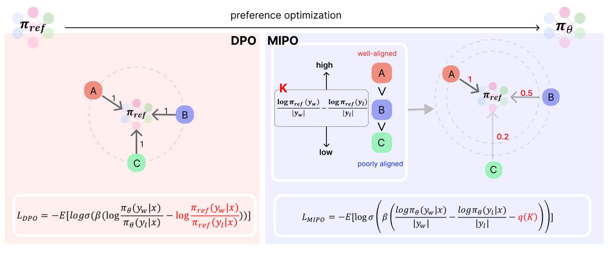
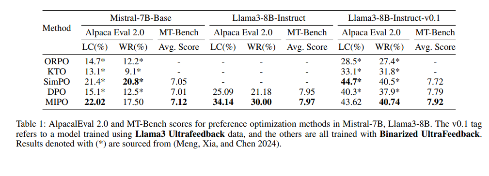
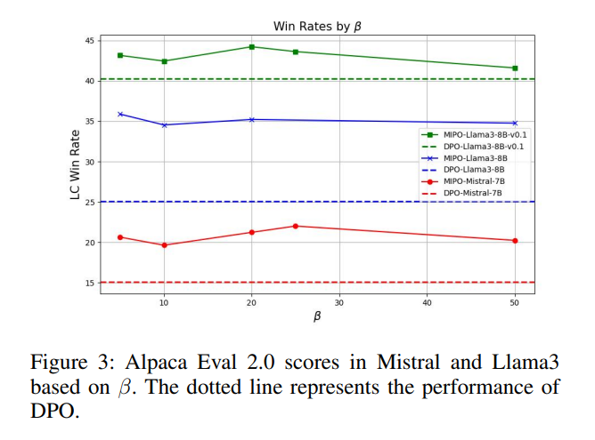

# MIPO: Modulated Intervention Preference Optimization


This repository is for training preference optimization using the Modulated Intervention Preference Optimization (MIPO), which improves upon the issues of the existing DPO. MIPO allows for more efficient learning by adjusting the intervention of the reference model for each instance. When MIPO was used with the Llama3-8B and Mistral-7B models, it showed significantly better performance than DPO on Alpaca Eval 2.0and MT-bench.

</img>
</img>

You can find detailed information in this [paper](https://arxiv.org/abs/2409.17545).


# How to Use

It was implemented based on the code from the [Alignment Handbook](https://github.com/huggingface/alignment-handbook) and developed to be used with the trl Trainer.

### Training Scripts

* Example - Llama3-8B-Instruct:
```shell
CUDA_VISIBLE_DEVICES=0,1,2,3,4,5,6,7 torchrun --nproc_per_node=8 src/run_mipo.py configs/llama3/config.yaml
```

### Hyperparameter Tuning

As mentioned in Section 6.2 of the paper, the performance differences are not significant across the range of hyperparameters. In most cases, good results were achieved when using values between 5 and 25.

</img>

### Citation
Please cite our paper if you find the repo helpful in your work:
```shell
@article{jang2024modulated,
  title={Modulated Intervention Preference Optimization (MIPO): Keep the Easy, Refine the Difficult},
  author={Jang, Cheolhun},
  journal={arXiv preprint arXiv:2409.17545},
  year={2024}
}
```


